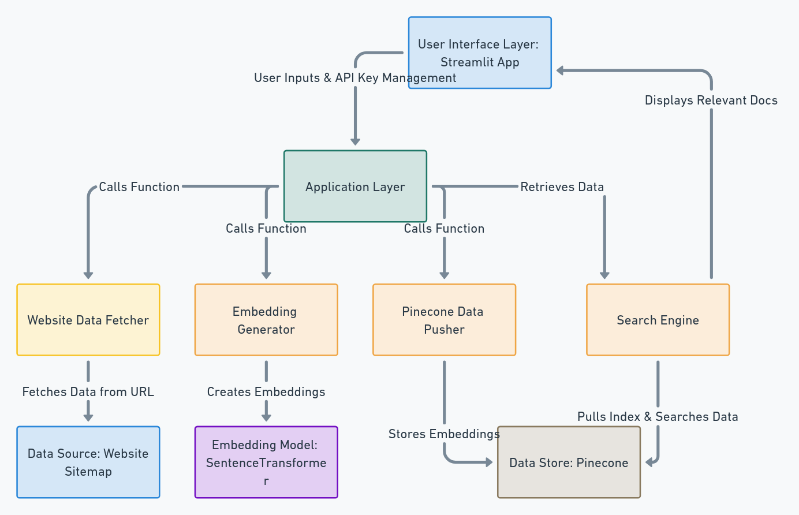

# Support Chat Bot for Your Website

## Overview
This project provides a support chat bot solution that integrates with your website to enhance customer support. By utilizing embeddings and vector storage, the bot fetches relevant information from a predefined website and retrieves contextual answers based on user queries. This system can greatly improve user experience by providing quick and accurate responses.

## Architecture
The architecture is modular and follows a layered approach to separate concerns and ensure scalability. Below are architectural diagrams illustrating the key components and their interactions:

### System Architecture


### User Interface Design


### Key Components
1. **User Interface Layer (Streamlit App)**: Captures user queries, API keys, and provides search results in an interactive UI.
2. **Application Layer**: Manages communication between the user interface and various functional modules (e.g., data fetcher, embedding generator).
3. **Website Data Fetcher**: Extracts data from a website's sitemap to serve as the bot's knowledge base.
4. **Embedding Generator**: Uses SentenceTransformers to generate embeddings for documents, enabling similarity-based search.
5. **Pinecone Data Pusher**: Pushes embeddings to Pinecone, a vector database for efficient storage and retrieval.
6. **Search Engine**: Retrieves relevant documents from Pinecone based on user queries.

## Technologies Used
- **Streamlit**: User interface for interacting with the chat bot.
- **LangChain & SentenceTransformer**: For embedding generation, enabling similarity-based searches.
- **Pinecone**: Vector database for indexing and retrieving document embeddings.
- **dotenv**: Manages environment variables securely.

## Installation and Setup
To set up the project in your local environment, follow these steps:

```bash
# Clone the repository
git clone <repository-url>

# Navigate into the project directory
cd Support-Chat-Bot-For-Your-Website

# Install dependencies
pip install -r requirements.txt

# Configure environment variables
cp .env.example .env
# Edit the .env file with your Pinecone API key, HuggingFace API key, and other required configurations
```

## Usage
1. Start the Streamlit app:

    ```bash
    streamlit run app.py
    ```

2. Enter your HuggingFace and Pinecone API keys in the sidebar.
3. Use the sidebar to load data from the website into Pinecone.
4. Enter a query, select the number of results, and click **Search**.

## Configuration Options
- **Environment Variables**:
    - `PINECONE_API_KEY`: API key for Pinecone integration.
    - `HUGGINGFACE_API_KEY`: API key for HuggingFace embeddings.
    - Additional variables can be configured in the `.env` file.

## Testing Guidelines
To test the system, ensure that:
- Relevant data from the specified website is correctly fetched and indexed in Pinecone.
- The embeddings generated for documents are accurate.
- The bot retrieves relevant responses based on user queries.


